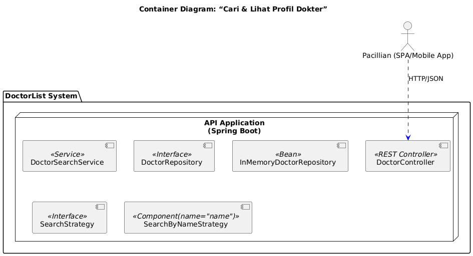

Individual Diagram :

# Deployment

Link: [BE-Profile Deployment](http://34.225.152.182/)

# Doctor Profile Service

Doctor Profile Service merupakan salah satu microservice dalam sistem PandaCare yang bertanggung jawab untuk menyediakan fitur pencarian dan penampilan profil dokter da. Layanan ini memungkinkan Pacillians (pengguna) untuk mencari  Caregiver (dokter) berdasarkan kriteria seperti nama, spesialisasi, atau jadwal kerja, serta melihat informasi detail dokter seperti alamat praktek, email, nomor telepon, dan rating.

Pada fitur "Mencari & Melihat Profil Dokter", digunakan Strategy Pattern. Karena pencarian dokter bisa dilakukan berdasarkan berbagai kriteria seperti nama, spesialisasi, atau jadwal kerja, maka Strategy Pattern memungkinkan tiap jenis pencarian di enkapsulasi dalam class terpisah. Hal ini membuat penambahan kriteria pencarian baru dapat dilakukan tanpa mengubah kode yang sudah ada. Dengan mendefinisikan sebuah antarmuka atau interface untuk strategi pencarian, saya hanya perlu membuat class konkret yang menangani logika pencarian berdasarkan suatu kriteria tertentu. Strategy pattern juga mendukung Open-Closed Principle. Prinsip ini jika nantinya saya ingin menambahkan kriteria pencarian baru semisal, pencarian berdasarkan lokasi atau rating maka hanya perlu menambahkan class strategy baru tanpa mengubah kode yang udah ada sebelumnya.

# Doctor Search Feature  
Branch: `FilterNListDoctor`  
Created by: Figo Favian Ragazo (2306241764)  

### Deskripsi  
Fitur ini menyediakan kemampuan bagi Pacillians untuk:  
- Mencari dokter berdasarkan **nama**, **spesialisasi**, dan **jadwal kerja**.  
- Melihat **detail profil dokter** seperti:  
  - Nama  
  - Alamat praktik  
  - Jadwal kerja  
  - Email  
  - Nomor telepon  
  - Rating  

### Design Pattern yang Digunakan

#### 1. **Strategy Pattern**  
- **Lokasi Implementasi**: `service/strategy/`  
- **Penjelasan**:  
  - Setiap strategi pencarian diimplementasikan dalam kelas yang berbeda, misalnya:  
    - `SearchByNameStrategy`  
    - Kelas strategi lain dapat ditambahkan tanpa mengubah `DoctorSearchService`  
  - Strategi-strategi ini dikelola melalui sebuah `Map<String, SearchStrategy>` di `DoctorSearchService`.  

#### 2. **Repository Pattern**  
- **Lokasi Implementasi**: `InMemoryDoctorRepository`  

#### 3. **Service Layer Pattern**  
- **Lokasi Implementasi**: `DoctorSearchService`   

